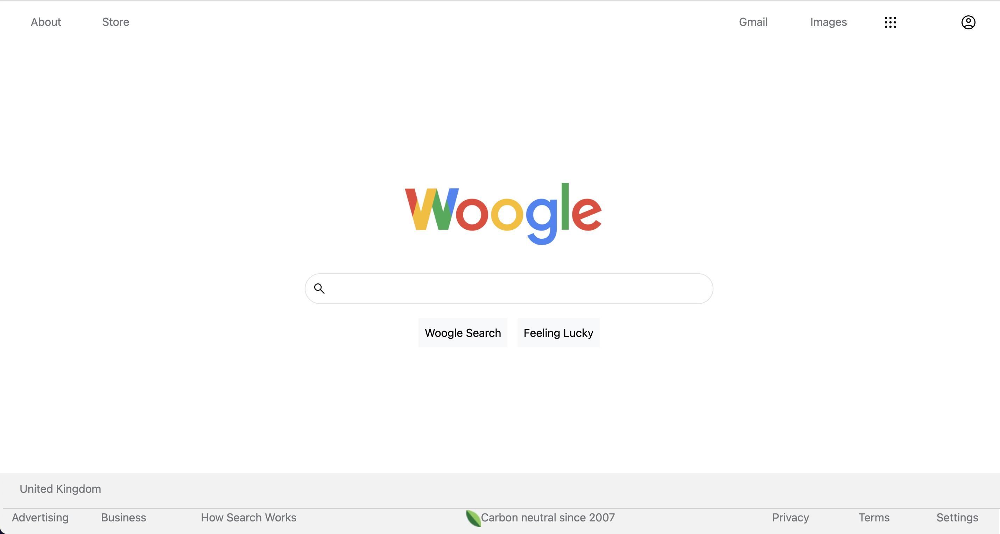
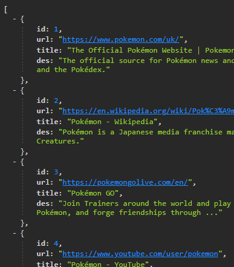

# lap1_coding_challenge

## George &amp; Kai's Custom Google API - **_Woogle_**

LAP 1 coding challenge requires us to create our own simplistic version of Google. And here we are ⬇  

---
## Installation and Usage
### Installation
- Clone the repo into a folder of your choosing on your machine.
    - `git clone https://github.com/georgewood749/lap1_coding_challenge.git`
- Once you have cloned the repo and opened in VS Code, enter `cd server` in the terminal to move into the server directory.
- You'll need to install the node modules used in the project, this can be achieved by running `npm i` or `npm install`.
- Once you have the required node packages installed, you'll need to enter `npm run dev` in the terminal to start up the server.

### Usage

>**Searching**  

Once the server is running, you can open the page using live server.  
Try entering a keyword in the search bar to filter results from our data set.  
When you enter a search keyword, either press the **"Woogle Search"** button, or hit **return** to display the results.  
The page will display 10 search results.  
If there are less than 10 results for your keyword, remainder will be populated with sponsored content. 

>**Feeling Lucky and Show Me All**  

You can click the **"Feeling Lucky"** button to display a random item of sponsored content.  
If you click the Woogle logo, all items will be displayed on screen.  

>**FIUWMI(Fake It Untill we made it)**  

We've included hyperlinks to Google's pages for each of the header and footer navigation items.  
However, we are yet to add functionality for the apps and profile buttons in the top right.  

---
## Changelog
1. Made a page with an embedded Google search bar  

<!--  -->
2. Disgarded the Google Programmable Search Engine and created a custom API with custom links in it instead  

<!--  -->
3. Created a button to display all results on the home page
4. Created a feel lucky botton to display a random result
5. Created the search algorithm and implement to the website
6. Final touches to the CSS styling to match the real Google page

---
## Bugs
- Footer was not displaying on the bottom of the page due to the results section. The footer was only dropping to the bottom of the page after a search has been run. 
    - This was solved by using fixed positioning for the footer and some hard-coding.
- .forEach() would not iterates for single entry array.
    - made a separated function for displaying a single entry array  

---
## Wins and Challenges
### Wins
- Functionality works as intended
- Styling matches Google's own quite well
- No issues with the server

### Challenges
- Some styling required hard-coding to get the intended effect, we've attempted to avoid this where possible however, but due to time contstraints some css properties have remained hard-coded.
- Tried to see if we can use the Google API but the best we can do is to add an embedded goggle search bar and use thier display.
- Unable to set up the test suite
